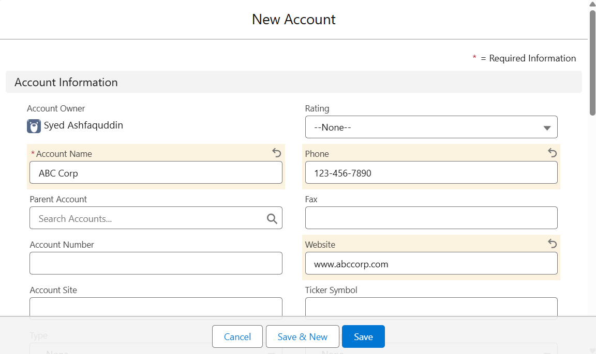
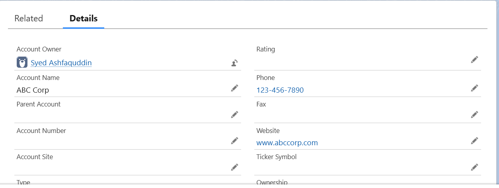

# Lab 1.0 - Introduction to Salesforce

**Duration:** 20 minutes  
**Objective:**  
To explore the Salesforce platform and understand its core purpose, features, and use cases through a hands-on orientation in a Salesforce Developer Org.

---

## 🎯 Learning Outcomes
- Sign up and log in to Salesforce Developer Org  
- Navigate the Salesforce Lightning Experience interface  
- Explore core features and standard objects  
- Create a sample record in Salesforce  

---

## 🛠️ Lab Instructions & ✅ Solution

### 1. Sign Up / Log In to Salesforce Developer Org
- **Action:**  
  - Visited [Salesforce Developer Signup](https://developer.salesforce.com/signup).  
  - Created a **free Developer Org** (or used existing Trailhead Playground).  
- **Outcome:** Successfully logged in with Developer Edition access.  

---

### 2. Navigate the Salesforce Lightning Interface
- **Action:** Switched to **Lightning Experience** (modern UI).  
- **Explored UI Elements:**  
  - **App Launcher (waffle icon):** Used to search/open apps.  
  - **Setup Menu (gear icon):** Used for admin tasks and configuration.  
  - **Navigation Bar:** Provides quick access to tabs.  
  - **Standard Tabs:** Accounts, Opportunities, Contacts, Leads.  
- **Outcome:** Became familiar with navigation in Lightning UI.  

---

### 3. Explore Key Salesforce Features
- **Standard Objects:**  
  - Accounts (companies/customers)  
  - Contacts (people linked to accounts)  
  - Leads (potential customers)  
  - Opportunities (sales deals in progress)  

- **App Launcher:**  
  - Opened **Sales App** and **Service App**.  

- **Setup Menu:**  
  - Navigated to **Object Manager → Account Object**.  
  - Reviewed fields, page layouts, and relationships.  

- **Outcome:** Understood core CRM objects and app navigation.  

---

### 4. Create a Sample Record
- **Action:**  
  - Navigated to **Accounts tab → New**.  
  - Created a new account with:  
    - **Name:** ABC Corp  
    - **Phone:** 123-456-7890  
    - **Website:** www.abccorp.com  
  - Saved the record.  
- **Outcome:** Sample account created successfully and visible in the Accounts list.  

---

## 📌 Expected Deliverables
- ✅ Developer Org created and accessed in Lightning Experience  
- ✅ Familiarity with App Launcher, Setup menu, Navigation Bar, and Standard Objects  
- ✅ Successfully created a **sample account record (ABC Corp)**  

---

