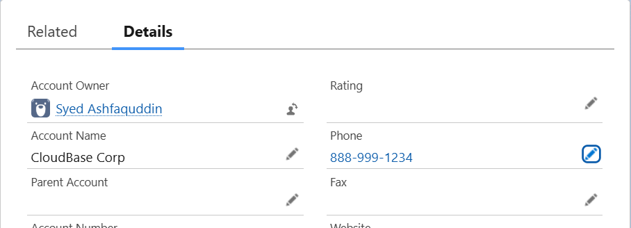
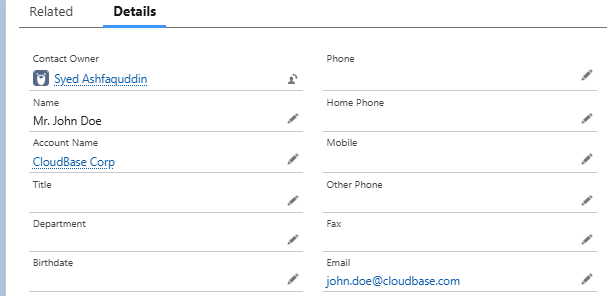
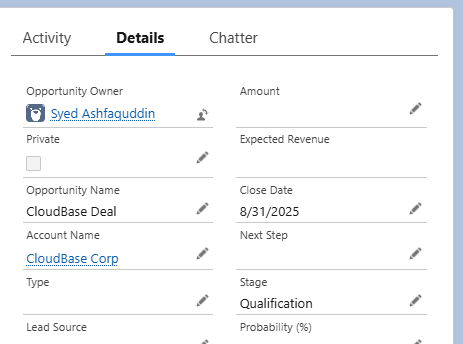

# Lab 1.3 - Exploring Key Components and Features

**Duration:** 20 minutes  
**Objective:**  
To explore and understand the core components of the Salesforce platform — including Objects, Tabs, Apps, and Records — through guided navigation and interaction in the Salesforce Lightning Experience.

---

## Learning Outcomes

- Explore standard Salesforce objects and their configurations
- Create sample records in Accounts, Contacts, and Opportunities
- Understand app navigation and structure differences between Sales and Service apps

---

## Lab Instructions & Solution

### 1. Explore Standard Salesforce Objects

- **Action:**
  - Opened **Sales App** via App Launcher.
  - Setup → **Object Manager** → Viewed **Account, Contact, and Opportunity** objects.
- **Explored for each object:**
  - **Fields & Relationships** → Identified standard fields like `Name`, `Phone`, `Email`, `Stage`.
  - **Page Layouts** → Reviewed field placements and related lists.
  - **Record Types** → Checked availability (e.g., multiple sales processes in Opportunities).
- **Outcome:** Gained understanding of object structure and customization options.

---

### 2. Create Sample Records in Standard Objects

- **Account Created:**

  - **Name:** CloudBase Corp
  - **Phone:** 888-999-1234

- **Contact Created:**

  - **First Name:** John
  - **Last Name:** Doe
  - **Email:** john.doe@cloudbase.com
  - **Related Account:** CloudBase Corp

- **Opportunity Created:**

  - **Name:** CloudBase Deal
  - **Close Date:** End of current month
  - **Stage:** Qualification
  - **Related Account:** CloudBase Corp

- **Outcome:** Successfully created linked records (Account → Contact → Opportunity).

---

### 3. Explore Navigation and App Customization

- **Action:**
  - Switched between **Sales App** and **Service App** from App Launcher.
  - Observed:
    - Sales App → Tabs: Leads, Accounts, Opportunities, Leads.
    - Service App → Tabs: Cases, Reports, Chatter.
  - Setup → **App Manager → Sales App (View mode)**.
  - Reviewed available tabs and **navigation style (Standard app)**.
- **Outcome:** Understood differences in app structure and tab availability.

---

## Expected Deliverables

- Created one **Account**, one **Contact** (linked), and one **Opportunity** (linked).
- Explored **Object Manager** for Account, Contact, and Opportunity objects.
- Reviewed **Sales App vs Service App** tabs and navigation style.

---

