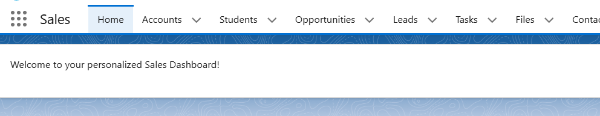
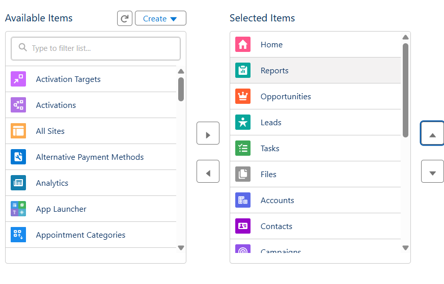

# Lab 1.2 - Navigation in Salesforce Lightning Experience

**Duration:** 15 minutes  
**Objective:**  
To become familiar with the Salesforce Lightning Experience interface and practice customizing list views, home page layout, and app navigation.

---

## Learning Outcomes

- Explore the Salesforce Lightning Experience (Sales vs Service App)
- Create and customize List Views
- Modify Home Page using Lightning App Builder
- Update App Tabs for better navigation

---

## Lab Instructions & Solution

### 1. Explore the Lightning Experience

- **Action:** Logged into Salesforce Developer Org and opened:
  - **Sales App** → Tabs: Leads, Accounts, Contacts, Opportunities.
  - **Service App** → Tabs: Cases, Knowledge, Service Setup.
- **Observation:** Sales App focuses on revenue pipeline, Service App focuses on customer support.

---

### 2. Create and Customize a List View

- **Action:** Navigated to **Leads tab → Gear Icon → New List View**.
- **Configuration:**
  - **Name:** `Open Leads This Month`
  - **Filter Criteria:**
    - Status = `Open - Not Contacted`
    - Created Date = `Current Month`
  - **Columns Added:** Lead Owner, Company, Lead Source, Created Date
- **Outcome:** List View saved and pinned as default.

---

### 3. Customize the Home Page Using Lightning App Builder

- **Action:**
  - Setup → **App Builder → Edit Home Page**
  - Added a **Rich Text Component** with message:
    > Welcome to your personalized Sales Dashboard!
- **Activation:** Applied changes for **Sales App only**.
- **Outcome:** Customized Home Page now displays welcome message when using Sales App.
  

---

### 4. Modify App Tabs for the Sales App

- **Action:**
  - Setup → **App Manager → Sales App → Edit**
  - Added tabs: **Reports, Dashboards, Campaigns**
  - Reordered so that **Reports appear second** in the navigation bar.
- **Outcome:** Sales App navigation updated with additional tabs and correct order.
  

---

## Expected Deliverables

- New custom **List View for Leads** with correct filters and columns.
- Customized **Home Page** with Rich Text welcome message.
- Modified **Sales App Tabs** including Reports, Dashboards, and Campaigns (with Reports in 2nd position).
- All changes visible in Salesforce Lightning Experience.

---
